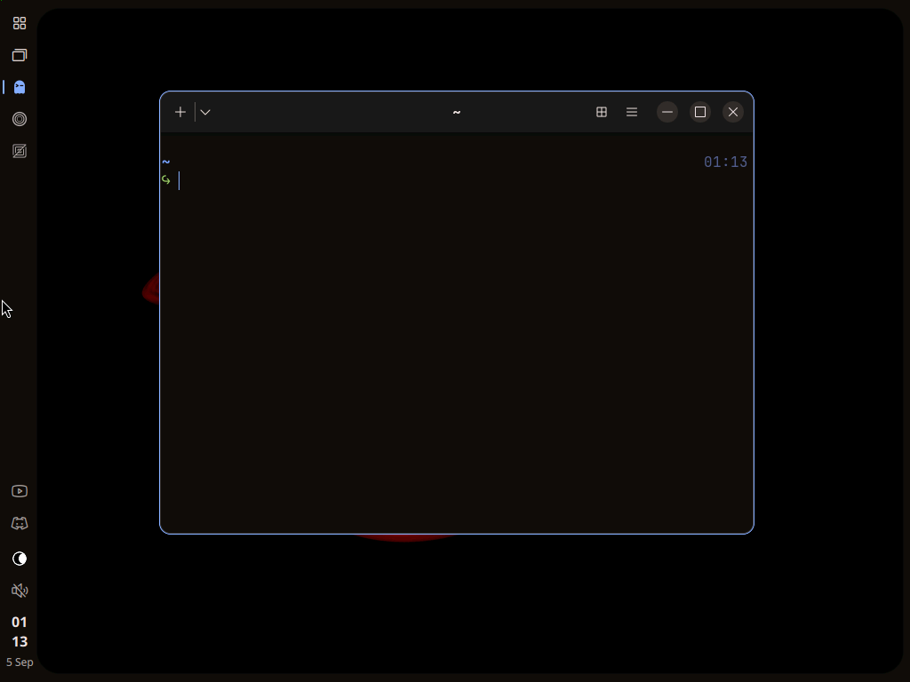

# Ikigai

An opinionated developer workstation on **Arch Linux**: COSMIC's compositor underneath,
Ikigai's own shell on top.

No questions. No bullshit.



## Install

Ikigai is to Arch what Proxmox is to Debian: it layers onto an existing install rather
than replacing it. Two ways in, one installer.

**Already on Arch?** From the machine, or SSH'd into it:

```sh
curl -fsSL https://raw.githubusercontent.com/MSILycanthropy/ikigai/main/boot.sh | bash
```

**Not yet?** Boot the [official Arch ISO](https://archlinux.org/download/) and let
`archinstall` do the base install with Ikigai's config — it preselects the minimal
profile, systemd-boot and NetworkManager, asks you only for disk, user, password and
timezone, then runs the line above for you:

```sh
archinstall --config-url https://raw.githubusercontent.com/MSILycanthropy/ikigai/main/archinstall.json
```

(To do that from another machine: on the live ISO run `passwd`, `systemctl start sshd`,
`ip -br addr`, then `ssh root@<ip>` and run it there.)

**On Windows, no USB stick?** From an administrator PowerShell, with Secure Boot off in
your firmware and BitLocker off:

```powershell
irm https://raw.githubusercontent.com/MSILycanthropy/ikigai/main/boot.ps1 | iex
```

It asks whether to replace Windows or dual boot, puts the Arch ISO on a small new
partition, boots it once, and the ISO runs the `archinstall` line above for you. Windows
stays intact until you confirm the disk in archinstall; before that, `-Undo` puts
everything back. Dual boot keeps Windows' boot partition and adds Ikigai next to it,
with both on systemd-boot's menu; back in Windows, run it once with `-Clean`.

Either way: one sudo prompt, ~10 minutes, `sudo reboot` into the Ikigai greeter. There
is no setup wizard: locale and keyboard come from archinstall or the system you had.

**Supported** means a fresh minimal Arch (what the config above produces) — that's what
gets tested. On an Arch box that already has a desktop it *works*, best-effort: Ikigai
won't touch your dotfiles, but its greeter takes over `display-manager.service` from
whichever one you had, and cosmic-comp's defaults land as system config next to yours.

## What you get

| | |
|---|---|
| Desktop | [COSMIC](https://system76.com/cosmic)'s compositor, Settings, Files, portal and daemons from Arch `extra`. The panel, launcher, notifications, OSD, greeter, lock and polkit prompt are Ikigai's; COSMIC's versions are not installed. NASA black-hole wallpaper |
| Theme | One palette, `themes/ikigai/palette.json`: Material 3 neutrals seeded from the wallpaper's orange (near-black warm greys), the accent from its blue, and an ANSI 16 built in OKLCH. `scripts/theme-build.py` renders it into the rail, COSMIC (window chrome, libcosmic apps), Ghostty, btop, Vicinae and a libadwaita `gtk.css` that adw-gtk3 and Qt's gtk3 platform theme carry to GTK 3 and Qt apps. Every other terminal tool follows the terminal's ANSI colours |
| Rail | Ikigai's own [Quickshell](https://quickshell.org) shell: a thin autohiding rail inside a rounded frame, popouts that melt out of it. Pinned and running apps (click to focus, again to minimize, middle-click to close, right-click to pin or move), a task view of workspaces and windows, tray, volume card with output picker, clock. The look, and the blob renderer that draws it, are [soramanew's caelestia-shell](https://github.com/caelestia-dots/shell) — see [Credits](#credits) |
| Notifications | Toasts out of the rail, a sidebar (click the clock) with the history, a calendar and do-not-disturb, an unread badge. Volume and brightness changes show a pill at the bottom edge |
| Launcher | [Vicinae](https://vicinae.com) on `Super`: apps, files, clipboard history, and its own log out, power off, reboot and sleep commands |
| Greeter | Ikigai's, on greetd: cosmic-comp in kiosk mode drawing the same card as the lock screen, with the theme and wallpaper, your avatar from Settings, and the last user preselected |
| Lock | `Super+L`, the idle timeout or the lid: logind locks, the shell draws the card over every screen and checks the password through PAM. The same card answers polkit when an app asks for privilege |
| First login | A welcome card on the shell: the keys, the rail, where settings live, and a Connect to Wi-Fi button when the box is offline. Once per user (`~/.local/state/ikigai/welcomed`); `ikigai-shell welcome open` brings it back |
| Network | NetworkManager, on the rail: the Wi-Fi strength or the wired link as the glyph, a card with the Wi-Fi switch, the wired link and the networks in range. Click to connect; a new secured network asks for its password in a window; the connected row expands to Disconnect and Forget. cosmic-settings' Network page for VPNs and the rest |
| Battery | On the rail when there is one: level and charging state as the glyph, a card with the time left and the power profile (upower, power-profiles-daemon) |
| Settings | cosmic-settings, with the rail in place of its panel: the Panel and Dock pages are inert, everything else works. The rail's own settings (pins, autohide, scale) are in `~/.config/ikigai/shell.json` for now |
| Video | [mpv](https://mpv.io) with hardware decoding, fuzzy subtitle matching and resume-where-you-left-off seeded |
| Screenshots | `Print` freezes the screen and opens the shell's picker: Region, Window or Screen, then Snip, Edit or Record. Snip puts the PNG on the clipboard and in `~/Pictures/Screenshots`; Edit opens it in [satty](https://github.com/gabm/Satty); Record starts [gpu-screen-recorder](https://git.dec05eba.com/gpu-screen-recorder/) on it with the system's audio, shows a dot and timer on the rail, and `Super+Shift+R` or a click on the dot stops it with the file's path (`~/Videos/Recordings`) on the clipboard. `Shift+Print` starts in Screen mode. Captured by [grim](https://gitlab.freedesktop.org/emersion/grim) over ext-image-copy-capture |
| Switcher | Windows-style Alt+Tab in the rail's language: hold Alt, Tab cycles live previews most-recent-first across workspaces (minimized included), release to switch, Shift+Tab backwards, Escape cancels, click a tile. Previews come from the bridge over ext-image-copy-capture |
| Icons | [Phosphor](https://phosphoricons.com) everywhere: the rail's glyphs, and an `Ikigai` symbolic icon theme built from Phosphor that COSMIC's window buttons, cosmic-settings, GTK header bars and Qt apps all pick up. Ghostty, Zen and Zed get hand-drawn marks in Phosphor's grammar on the rail (`shell/icons/brand`); app icons elsewhere stay their own |
| Terminal | [Ghostty](https://ghostty.org) + [zellij](https://zellij.dev) (unlock-first keybinds, `zj` to attach) |
| Shell | zsh (no framework) + [starship](https://starship.rs), autosuggestions, syntax highlighting, oh-my-zsh's git aliases |
| Editor | [Zed](https://zed.dev) (Tokyo Night, fetched from Zed's registry on first launch: the one app not on the Ikigai theme); Neovim with a minimal config on the terminal palette |
| Browser | [Zen](https://zen-browser.app) |
| Apps | [Discord](https://discord.com) and [YouTube Music](https://github.com/pear-devs/pear-desktop) (th-ch's desktop app, now Pear Desktop, AUR `pear-desktop-bin`), pinned at the bottom of the rail |
| Dev | [gh](https://cli.github.com), [just](https://just.systems), and [Claude Code](https://code.claude.com) through its native installer (`~/.local/bin/claude`, updates itself) |
| Runtimes | [mise](https://mise.jdx.dev) — `mise use -g node@lts`; Arch builds mise without `self-update`, pacman updates it. Docker + lazydocker (you're added to the `docker` group, which is root-equivalent) |
| TUIs | yazi (`y`), lazygit (`lg`), btop |
| CLI | ripgrep, fd, fzf, bat, eza, dust, git-delta, tealdeer, jq, fastfetch (with the black holes as its logo) — with `ls`/`cat`/`du`/`grep` aliased to the modern ones |
| Fonts | JetBrainsMono Nerd Font, Noto |
| Firewall | ufw, deny incoming and allow outgoing, ssh kept when sshd is enabled; ufw-docker so Docker's published ports respect it |
| Gaming | Not installed by default. `ikigai-steam` installs Steam, the 32-bit driver for your GPU, gamemode, gamescope and mangohud and launches it; Proton comes with Steam, [protonup-qt](https://github.com/DavidoTek/ProtonUp-Qt) for Proton-GE |

### Keys

cosmic-comp's stock bindings, plus:

| Key | |
|---|---|
| `Super`, `Super+A` | Vicinae |
| `Super+W` | task view: workspaces and their windows, on the rail |
| `Super+L` | lock |
| `Super+P` | Displays, in Settings |
| `Alt+Tab` / `Alt+Shift+Tab` | window switcher, Windows-style (hold, cycle, release) |
| `Super+Return` / `Super+T` | Ghostty |
| `Super+E` | Zed |
| `Super+B` | Zen |
| `Print` / `Shift+Print` | screenshot picker, starting in Region / Screen mode |
| `Super+Shift+R` | record the screen through the same picker; again to stop |
| `Super+Shift+/` | searchable cheatsheet of every binding (`ikigai-keys` in a terminal) |

Log out, power off, reboot and sleep are Vicinae commands rather than chords: `Super`,
type the word.

## How it's put together

- **COSMIC config is shipped as system defaults** in `/usr/local/share/cosmic/`, which
  cosmic-config reads before `/usr/share`. Your own changes in Settings land in
  `~/.config/cosmic` and override per key — Ikigai never fights you for them.
- **App configs are seeded once** into `~/.config`, only where nothing exists. Your
  dotfiles are never overwritten (`IKIGAI_FORCE=1` if you want ours).
- **Theme files are Ikigai-owned** and re-applied by `ikigai-theme-set ikigai`. Any
  COSMIC theme customised in Settings is backed up to `~/.local/state/ikigai/backup/`
  before being replaced.
- **The installer shows a step list**: spinner, elapsed time per step and the last log
  line under the running one; a failed step prints its last 20 log lines. Everything a
  step printed is in `~/.local/state/ikigai/install.log`. Without a terminal (archinstall,
  `IKIGAI_PLAIN=1`) it prints plain `==> [n/10]` lines instead.
- **No AUR helper in the installer.** AUR packages are built with `makepkg`; `paru`
  is installed (from source) for *you* to use afterwards.
- **One session.** `ikigai-session` (Rust, `session/`) starts cosmic-comp on its own,
  gets `WAYLAND_DISPLAY` from cosmic-comp's session socket and brings up
  `ikigai-session.target`: cosmic-bg, cosmic-settings-daemon and cosmic-idle under Ikigai
  unit names, `ikigai-bridge` (COSMIC's toplevel and workspace protocols on
  `$XDG_RUNTIME_DIR/ikigai-bridge.sock` as JSON lines) and `ikigai-shell` (the Quickshell
  shell from `/usr/local/share/ikigai/shell`). [Vicinae](https://vicinae.com) runs
  alongside as a layer-shell overlay on the patched Qt below, under its own desktop name
  because it refuses layer-shell on anything called COSMIC; its config is seeded once with
  the Ikigai theme and telemetry off, and its welcome tour runs on first login. The shell
  reads its theme from `~/.local/state/ikigai/shell-theme.json` (written by
  `ikigai-theme-set`) and your settings from `~/.config/ikigai/shell.json` (seeded once:
  pinned apps, autohide, scale); both reload live. cosmic-comp's shortcuts point at the
  shell over `ikigai-shell <target> <call>` (Quickshell IPC). `ikigai.desktop` is the only
  session entry.
- **The greeter is the shell.** greetd runs `ikigai-greeter` as its own user: cosmic-comp
  in kiosk mode with the Quickshell greeter as its only client. No daemon: theme and
  wallpaper from `/usr/local/share/ikigai/theme`, users from `/etc/passwd`, avatars from
  AccountsService. When the card succeeds cosmic-comp exits with it and greetd starts the
  session.
- **Lock and polkit share the card.** `ikigai-session` listens to logind and relays Lock
  and Unlock to the shell, which draws ext-session-lock surfaces and checks the password
  through PAM. The shell is also the session's polkit agent, so an app asking for
  privilege gets the same card with what it wants written under the name.

Repo layout: `install/` (steps run by `install.sh`), `config/` (seeds), `themes/`
(`ikigai/palette.json` plus the app themes `scripts/theme-build.py` renders from it and the built COSMIC theme), `bin/` (`ikigai-keys`,
`ikigai-theme-set`, `ikigai-shell`, `ikigai-shot`, `ikigai-greeter`), `session/` (Rust: `ikigai-session` + `ikigai-bridge` and the session's
user units, built at install), `shell/` (the Quickshell shell, greeter and lock included), `greeter/` (greetd config and units), `tools/cosmic-theme-gen` (dev-only: builds the COSMIC theme from
`builder.ron`), `scripts/vm.sh` (Hyper-V test harness).

## Hardware

AMD and Intel graphics are first-class. NVIDIA gets `nvidia-open-dkms` installed and
is otherwise best-effort — COSMIC on NVIDIA is upstream's problem before it's ours.
The reference test environment is a Hyper-V VM; that's the path we actually verify.

## Status

v2: the shell replaced COSMIC's panel, launcher, notifications, OSD, greeter and lock,
and those packages are no longer installed. Both install paths work end to end. No update
mechanism yet — `git pull` in `~/.local/share/ikigai` + `pacman -Syu` + `paru -Sua` is
the honest answer for now.

Not yet: a settings card for the rail, a chooser when polkit offers several admins,
multi-monitor beyond "the sidebar on every screen, the card on the first".

Next, roughly in order: those, an update command (reconcile seeded files `.pacnew`-style —
the seed hashes are already recorded), a custom pacman repo so the installer needs no
AUR at all, an ISO with an SSH-first console, a second theme
(the palette pipeline and `tools/cosmic-theme-gen` are ready for it).

Notes on how COSMIC's config layering actually works: [docs/cosmic-config.md](docs/cosmic-config.md).

## Credits

The rail is a port of [caelestia-shell](https://github.com/caelestia-dots/shell) by
[soramanew](https://github.com/soramanew): its frame-and-rail layout, its Material 3
motion, and above all its blob renderer, the Qt Quick plugin that draws every panel as a
signed distance field and melts them together. Ikigai vendors that plugin verbatim
(`shell/plugin/blobs`, `scripts/vendor-blobs.sh`) and re-implements the QML around it for
cosmic-comp. If you like how this looks, that's their work.

## License

MIT, except `shell/` which is GPL-3.0 because it builds on caelestia-shell's blob renderer. Vendored third-party files are listed in [THIRD_PARTY.md](THIRD_PARTY.md).
